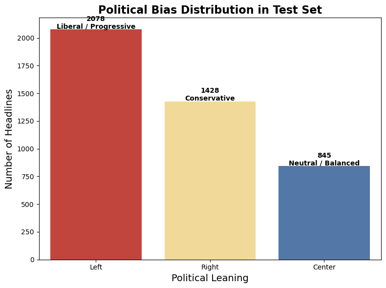

# 📰 NewsMind – Bias Detection & Political Leaning Classifier

> NewsMind is a transformer‑powered NLP project that detects political bias in news headlines.
> Built using **Hugging Face Transformers**, **Datasets**, and **PyTorch**, it fine‑tunes a **DistilBERT** model
> on the AllSides Balanced News dataset to classify headlines as **Left**, **Center**, or **Right** leaning.
> The project includes training code, evaluation metrics, and visualizations, and is ready for deployment or integration into interactive apps like **Gradio**.

---

## 📌 Project Overview

NewsMind is a Natural Language Processing (NLP) project that classifies political news headlines into **Left**, **Center**, or **Right** leaning categories.  
The model is built using **Hugging Face Transformers** (DistilBERT) and fine-tuned on the **AllSides Balanced News dataset**, which provides annotated headlines and their political bias ratings.

## 🎯 Features

✅ Fine-tunes a **DistilBERT** model for text classification  
✅ Uses **Hugging Face Datasets & Transformers** for efficient NLP workflows  
✅ Preprocesses and tokenizes text headlines for model training  
✅ Evaluates model with **accuracy, precision, recall, and F1-score**  
✅ Provides **data visualization** of class distribution with **Seaborn**  
✅ Ready for deployment and extension (e.g., Gradio web app)

---

## 📂 Dataset

- **Source:** [AllSides Balanced News Dataset](https://github.com/irgroup/Qbias)
- **Files Used:**
  - `allsides_balanced_news_headlines-texts.csv` → Contains headlines, full text, and `bias_rating`
- **Labels:** `left`, `center`, `right`

---

## 🏗️ Tech Stack

- **Language:** Python
- **Libraries:** Transformers, Datasets, PyTorch, Pandas, Seaborn, Matplotlib, scikit-learn
- **Model:** DistilBERT (Hugging Face)

---

## 📜 How It Works

1️⃣ **Data Loading & Preprocessing** – Load CSV, clean, and map `bias_rating` to numerical labels (0 = Left, 1 = Center, 2 = Right).  
2️⃣ **Tokenization** – Convert headlines into DistilBERT-compatible tokens.  
3️⃣ **Model Fine-Tuning** – Train DistilBERT with Hugging Face `Trainer`.  
4️⃣ **Evaluation** – Measure performance with metrics like accuracy and F1-score.  
5️⃣ **Prediction & Visualization** – Predict new headlines and visualize label distribution.

---

## 🚀 Setup & Installation

### 1️⃣ Clone the Repository

```bash
git clone https://github.com/yourusername/NewsMind.git
cd NewsMind
```

### 2️⃣ Install Dependencies

```bash
pip install -r requirements.txt
```

_or directly install core packages:_

```bash
pip install transformers datasets scikit-learn matplotlib seaborn accelerate
```

### 3️⃣ Run Jupyter Notebook

```bash
jupyter notebook NewsMind.ipynb
```

---

## 📊 Example Predictions

Input Headlines:

- _"Government announces new policy on climate change."_
- _"Opposition criticizes the ruling party for corruption allegations."_

Predicted Labels:

- **Center**
- **Left**

---

## 📊 Bias Distribution Chart

Below is the label distribution (Left, Center, Right) from the test dataset:



---

## 📈 Future Enhancements

- 🔹 Add **Gradio web app** for interactive bias checking
- 🔹 Integrate additional datasets for broader coverage
- 🔹 Experiment with larger LLMs (BERT, RoBERTa)

---

## 📜 License

This project is licensed under the MIT License – feel free to use, modify, and share.

---

## 🙌 Acknowledgments

- [Hugging Face](https://huggingface.co/) for Transformers & Datasets
- [AllSides](https://www.allsides.com/) for providing balanced news headlines dataset
